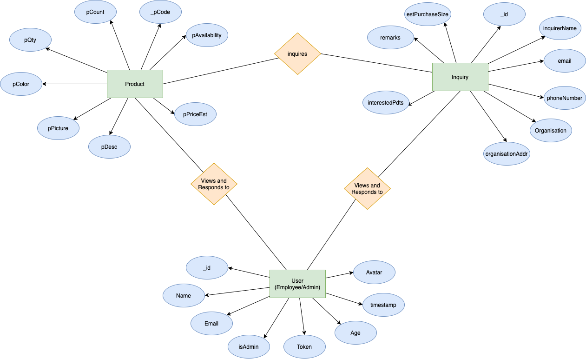

## Backend For a Yarn Trading Company Web App

An Inventory Management and Business Intelligence Web Application for a typical Small scale trading company in the textile industry.

*Node Express MongoDB Backend*

### DataModel/ER Diagram

### API Documentation

### Status Codes

1. 201 - Creation
2. 200 - Success
3. 400 - Bad Request
4. 401 - Unauthorized
5. 404 - Not Found

#### Employee Routes

1. Create Employee Account - POST */employee/create-employee*
   1. Request Body: JSON with name,email,password,department, isAdmin, token, age
   2. On Success: 201, {created newUser,token}
   3. On failure: 400

2. Login Employee/Admin - POST */employee/login*
   1. Request Body: JSON with email, password.
   2. On Success: 200, {userFound,token}
   3. On failure: 400

3. Read Profile - GET */employee/me*
    1. On success - 200, UserObject of user logged in
    2. On failure - 404

4. Logout One Device - POST */employee/logout*
   1.  On Success - 200
   2.  On failure - 500

5. Logout all devices - POST */employee/logout-all*
   1.  On Success - 200
   2.  On failure - 500

6. Delete User - DELETE */employee/:id*
   1. Note: - AdminAuth Required
   2. On Success - 200, deletedUser

### Products Routes

1. Create Product - POST */products*
   1. Payload/request body JSON example - {
        "pCount": 30,
        "pAvailability": true,
        "pCode": "R0004",
        "pColor": "Lemon Yellow",
        "pPriceEst": 91,
        "pQty": 100,
        "pDesc": "Purchased from Saraswathi Mills and Stock Updated on 12.12.12",
        "pPicture": *picture file*
    }
    2. On Success - 200, product with pPictureURL attribute which contains corresponding picture get url
    3. On Failure - 400

2. Get All Products - GET */tasks/summary*, GET */tasks?availability=true*, GET */tasks?limit=2&skip=2*, GET */tasks?sortBy=createdAt:asc*
   1. Optional queries
      1. availability=true - returns only products with availability attribute as true
      2. limit - limits returned products to given number
      3. skip - skips given number of top results
      4. sortBy:createdAt:asc/desc - sorts returned value by ascending or descending
      5. Success - 200, list of product objects

3. View product with product code - GET */products/:code*
    1. Request Params: Product code
    2. On Success: 200, product
    3. On Failure: 500

4. Update product by code - PATCH */products/:code*

   1. Request Param: Product Code
   2. Request Body: JSON with key value pairs to be updated (Only pCount, pAvailability, pPriceEst, pDesc are updatable)
   3. On Success:200, updated product
   4. On patch failure: 500
   5. On invalid Code: 404

5. Delete Product Code - DELETE */products/:code*
   1. Request Param: Product Code
   2. On Success:200, deleted product
   3. On patch failure: 500
   4. On invalid Code: 404

6. Get picture of product - GET */products/picture/:code*
   1. Request Param: Product Code
   2. On Success:200, picture
   3. On patch failure: 400
   4. On invalid Code: 404

### Inquiries Routes

1. Inquiry Creation (Public) - POST */inquiry*
   1. Sample Payload/ req body - {
    "inquirerName":"Sanjit",
    "email": "example@example.com",
    "phoneNumber":"9842314733",
    "organisation":"Sun Yarns and Weavers",
    "organisationAddr": "sample adress etc",
    "estPurchaseSize":300,
    "productsInq": ["R0001","R0002"],
    "remark":"Sample Text Lorem Ipsum Doleorem..."
}
    2. Success - 201, inquiry
    3. Failure - 400

2. List all Inquiries (Admin) - GET */inquiry*
   1. Success - 200, allInquiries
   2. Failure - 500

3. Delete Inquiry (Admin) - GET */inquiry/:id*
   1. Success - 200, deletedInquiry
   2. Failure - 500

4. All Products in Given Inquiry - GET */inquiry/:id/list-products*
   1. req.params.id - inquiry id
   2. Success - 200, list of products
   3. Failure - 500

5. All Inquires for given product - GET */inquiry/:id/list-inquires*
   1. req.params.id - inquiry id
   2. Success - 200, list of inquires
   3. Failure - 500

### Deployment

Backend Server Deployed in a [Heroku Server](https://sanjit-yarn-trading-backend.herokuapp.com) and Mongo Atlas Cluster.
Find front end repository [here](https://github.com/sanjitk7/yarnTradingCompanyFrontendv1)